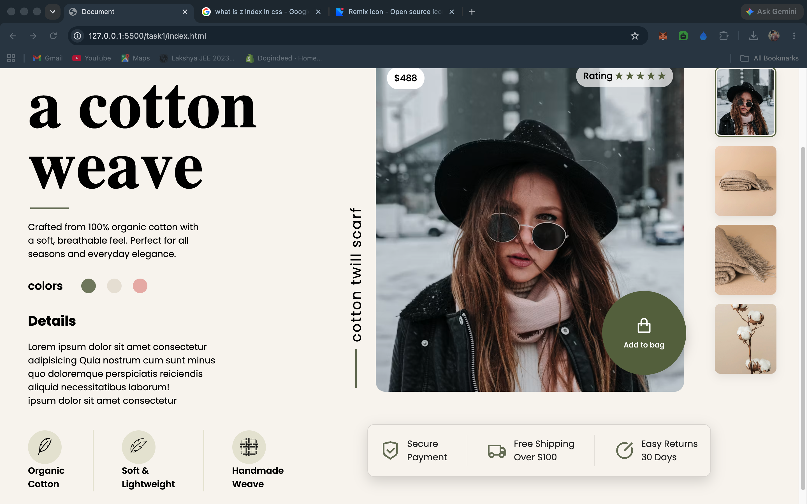
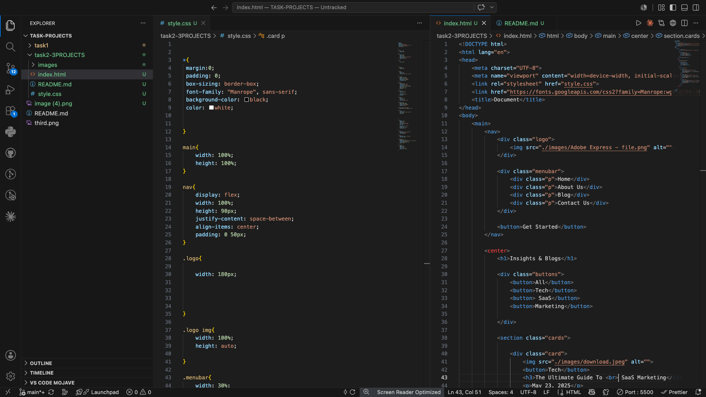
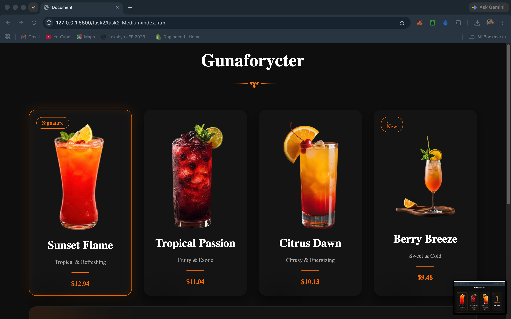

# Task-Projects

## Screenshots

### task1

### task2 - easy

### task2 - medium

### task2 - hard

### task3 - easy

## Notes
- Screenshots above were copied from each task folder and placed in the repository root.
- Each image referenced is the file in the repo root (not from any `images/` subfolder).

TASK1

task-3-easy

