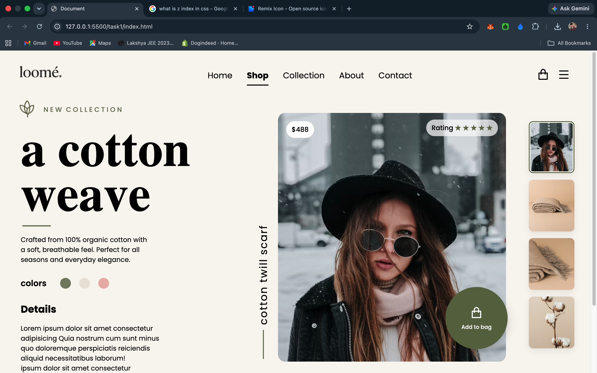
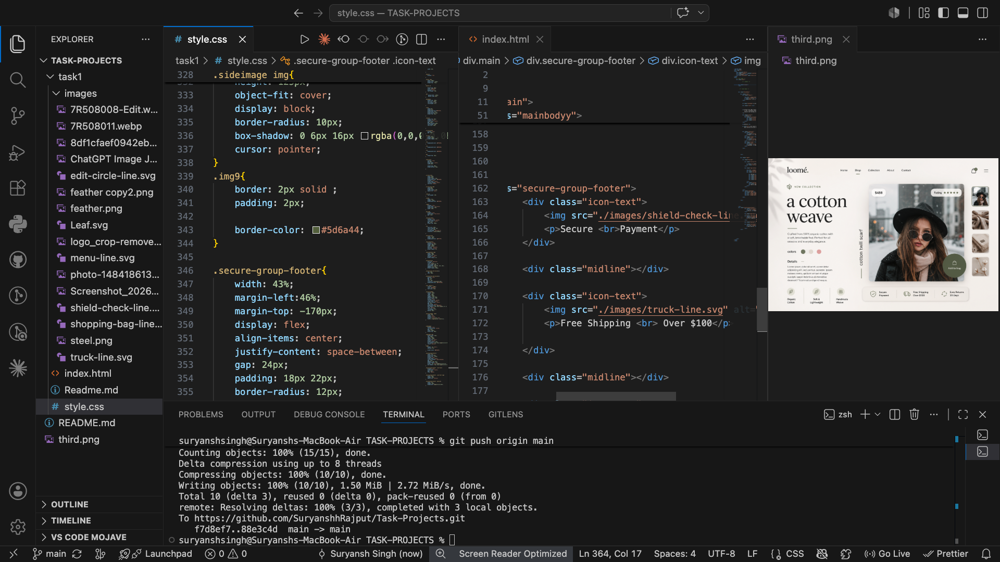
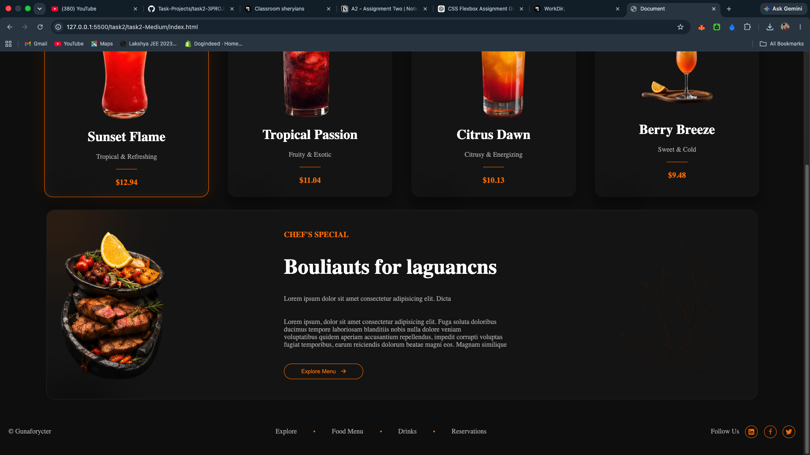
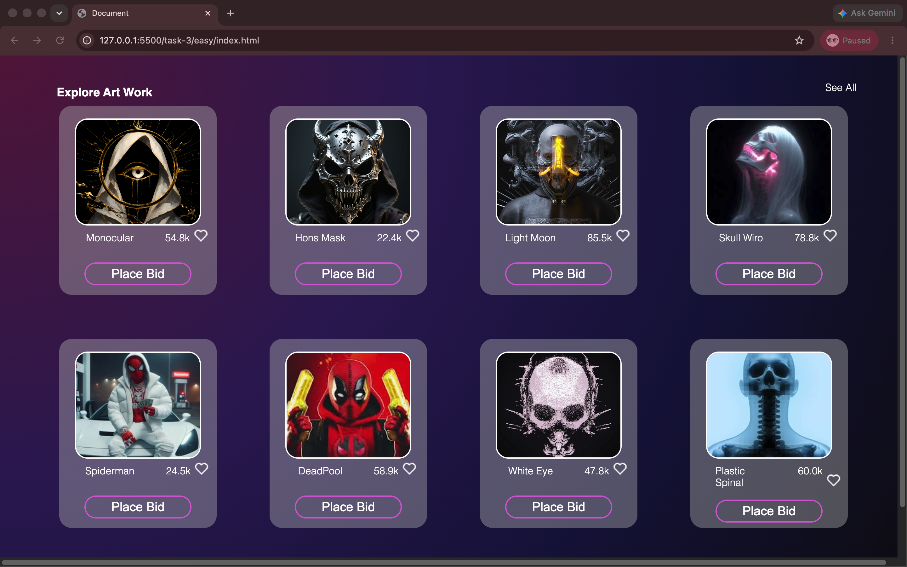
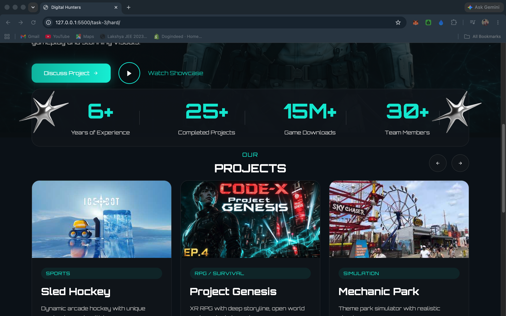
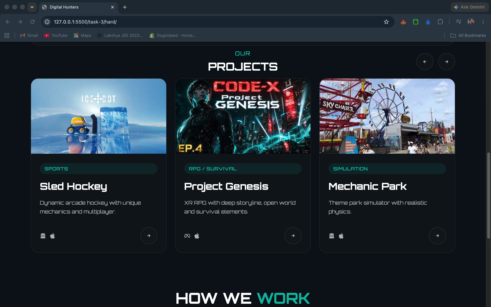
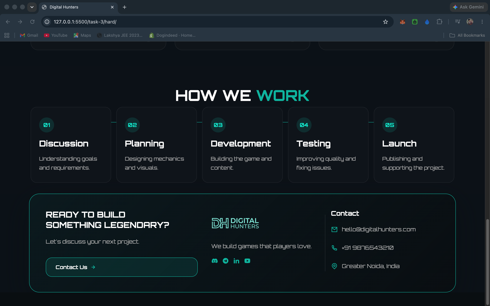
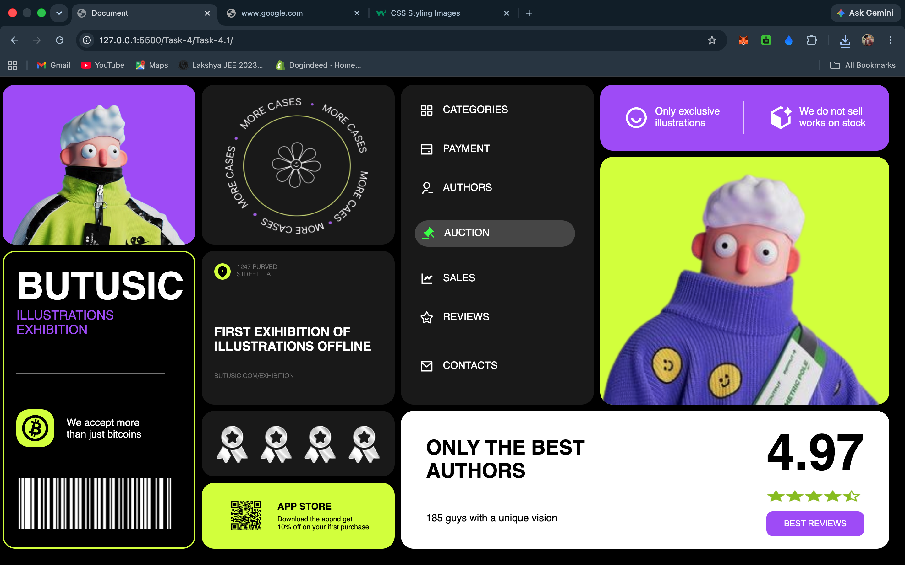

# Task-Projects

## Screenshots

### task1

### task2 - easy

### task2 - medium

### task2 - hard

### task3 - easy

### task3 - hard

### task4.1

## Notes
- Screenshots above were copied from each task folder and placed in the repository root.
- Each image referenced is the file in the repo root (not from any `images/` subfolder).

## Task 4.1
- This project is made using only CSS Grid and Flexbox.
- It showcases a structured layout with responsive section placement.

## Task 5 (Hard)
- Full-fledged Dribbble-like landing page (Task-5)
- Preview: https://task-5-suryansh-rajput.vercel.app/
