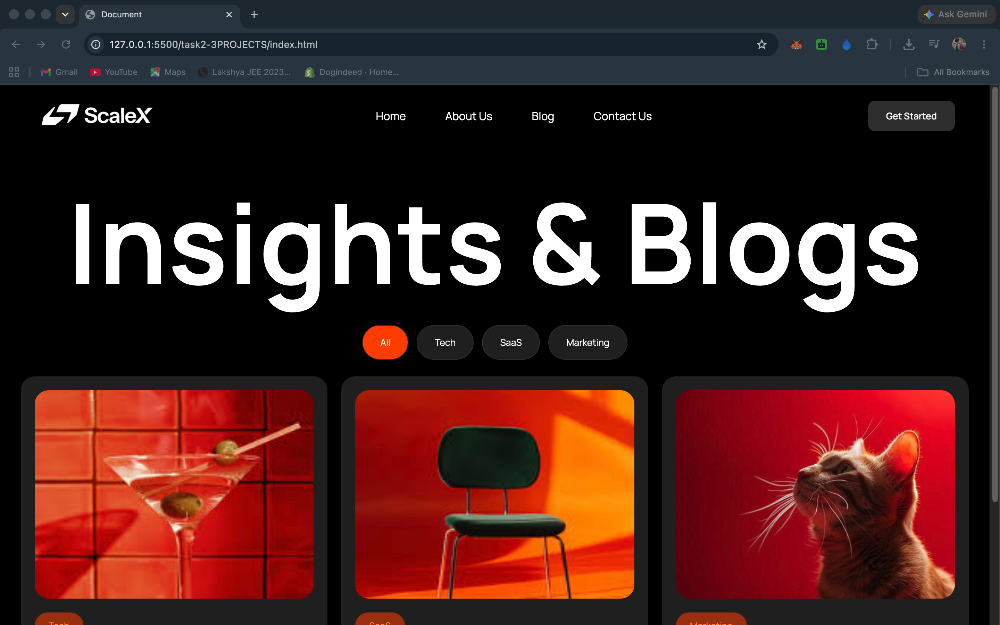

# Task 2-3 Projects

.png)

## Overview
This project was created in only 20 minutes.

I was struggling with image adjustment, but now nothing is stopping me — it is done perfectly.

## Notes
- Used only `flex` functionality for Task 2.
- The layout is built with a responsive navigation bar and a centered blog section.
- The heading is sized to cover 80% of the width and the center section has proper spacing.
