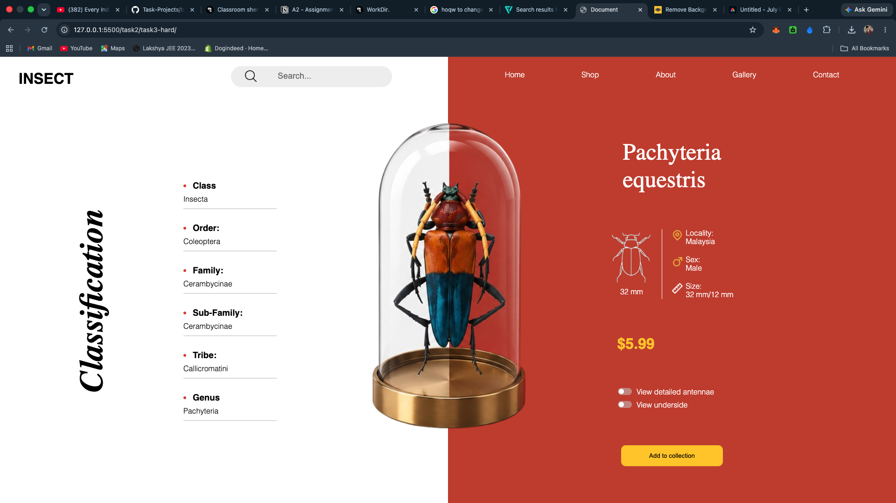

# Task 2 Hard

## Overview
This project is fully built using Flexbox and positioning — mastered the flexbox design in CSS.

Created quickly and implemented layout using only `flex` and positioning techniques.

Notes:
- Screenshot above is from the folder root (not the `images/` folder).
- Layout uses flex containers and positioned elements for alignment and responsiveness.
